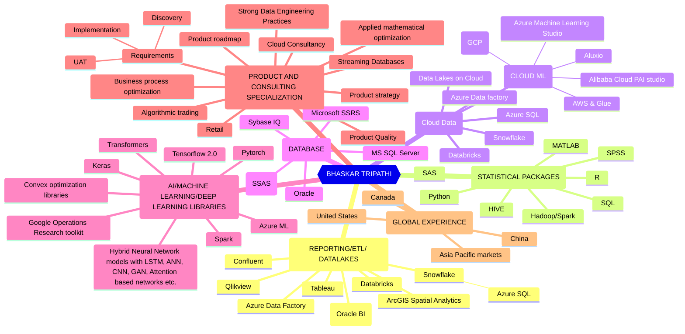

# My experience Summary
### If you are opening this page on www.bhaskartripathi.com IN Visual Studio web then press CTRL+SHIFT+V to view the graph.

```mermaid
mindmap
root{{BHASKAR TRIPATHI}}
  (REPORTING/ETL/ DATALAKES)
    Hyperion 9.0 (Oracle BI)
	  Qlikview
	  Tableau
	  ArcGIS Spatial Analytics
	  Databricks
	  Azure Data Factory
	  Confluent
	  Snowflake
    Azure SQL
  (STATISTICAL PACKAGES)
     MATLAB
     SPSS
     SAS
     SQL
     R
     Python
     Hadoop/Spark
     HIVE
  (Cloud Data)
     Azure Data factory
     Azure SQL
     Snowflake
     Databricks
     Data Lakes on Cloud
   (CLOUD ML)
     Aluxio
     Azure Machine Learning Studio
     AWS & Glue
     Google Cloud Platform (GCP)
     Alibaba Cloud PAI studio
  (DATABASE)
     MS SQL Server
     Sybase IQ
     Oracle
     Microsoft SQL Server Analysis Services (SSAS)
     Microsoft SSRS
  (AI/MACHINE LEARNING/DEEP LEARNING LIBRARIES)
     Azure ML
     Tensorflow 2.0
     Pytorch
     Keras
     Spark
     Transformers
     Convex optimization libraries
     Google Operations Research toolkit
     Hybrid Neural Network models with LSTM, ANN, CNN, GAN, Attention based networks etc.
  (PRODUCT AND CONSULTING SPECIALIZATION)
    Product strategy
    Requirements
      Discovery
      Implementation
      UAT
    Business process optimization
    Strong Data Engineering Practices
    Cloud Consultancy
    Applied mathematical optimization
    Product Quality
    Product roadmap
    Streaming Databases
    Algorithmic trading
    Retail
  (GLOBAL EXPERIENCE)
    United States
    Canada
    Asia Pacific markets
    China

```
