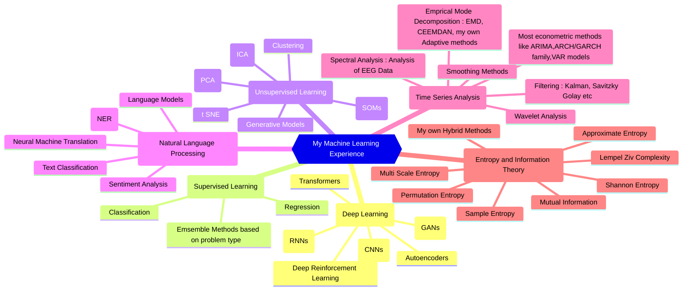
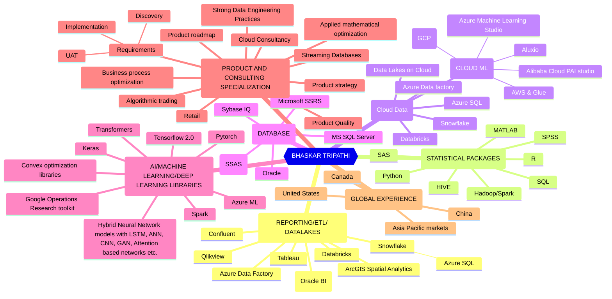

Visit www.bhaskartripathi.com for more details.

# My Machine Learning experience

``` mermaid
mindmap
root{{My Machine Learning Experience}}
  (Deep Learning)
    Convolutional Neural Networks (CNNs)
    Recurrent Neural Networks (RNNs)
    Generative Adversarial Networks (GANs)
    Autoencoders
    Transformers
    Deep Reinforcement Learning
  (Supervised Learning)
    Classification
    Regression 
    Emsemble Methods based on problem type   
  (Unsupervised Learning)
    Clustering
    Principal Component Analysis (PCA)
    Independent Component Analysis (ICA)
    t SNE
    Self Organizing Maps (SOMs)
    Generative Models
  (Natural Language Processing)
    Text Classification
    Named Entity Recognition (NER)
    Sentiment Analysis
    Language Models
    Neural Machine Translation
  (Time Series Analysis)
    Most econometric methods like ARIMA,ARCH/GARCH family,VAR models
    Smoothing Methods
    Filtering : Kalman, Savitzky Golay etc
    Emprical Mode Decomposition : EMD, CEEMDAN, my own Adaptive methods
    Wavelet Analysis
    Spectral Analysis : Analysis of EEG Data
  (Entropy and Information Theory)
    Permutation Entropy 
    Approximate Entropy 
    Sample Entropy 
    Lempel Ziv Complexity 
    Mutual Information 
    Shannon Entropy
    My own Hybrid Methods
    Multi Scale Entropy     
```

# My overall experience Summary

```mermaid
mindmap
root{{BHASKAR TRIPATHI}}
  (REPORTING/ETL/ DATALAKES)
    Hyperion 9.0 (Oracle BI)
	  Qlikview
	  Tableau
	  ArcGIS Spatial Analytics
	  Databricks
	  Azure Data Factory
	  Confluent
	  Snowflake
    Azure SQL
  (STATISTICAL PACKAGES)
     MATLAB
     SPSS
     SAS
     SQL
     R
     Python
     Hadoop/Spark
     HIVE
  (Cloud Data)
     Azure Data factory
     Azure SQL
     Snowflake
     Databricks
     Data Lakes on Cloud
   (CLOUD ML)
     Aluxio
     Azure Machine Learning Studio
     AWS & Glue
     Google Cloud Platform (GCP)
     Alibaba Cloud PAI studio
  (DATABASE)
     MS SQL Server
     Sybase IQ
     Oracle
     Microsoft SQL Server Analysis Services (SSAS)
     Microsoft SSRS
  (AI/MACHINE LEARNING/DEEP LEARNING LIBRARIES)
     Azure ML
     Tensorflow 2.0
     Pytorch
     Keras
     Spark
     Transformers
     Convex optimization libraries
     Google Operations Research toolkit
     Hybrid Neural Network models with LSTM, ANN, CNN, GAN, Attention based networks etc.
  (PRODUCT AND CONSULTING SPECIALIZATION)
    Product strategy
    Requirements
      Discovery
      Implementation
      UAT
    Business process optimization
    Strong Data Engineering Practices
    Cloud Consultancy
    Applied mathematical optimization
    Product Quality
    Product roadmap
    Streaming Databases
    Algorithmic trading
    Retail
  (GLOBAL EXPERIENCE)
    United States
    Canada
    Asia Pacific markets
    China

```

